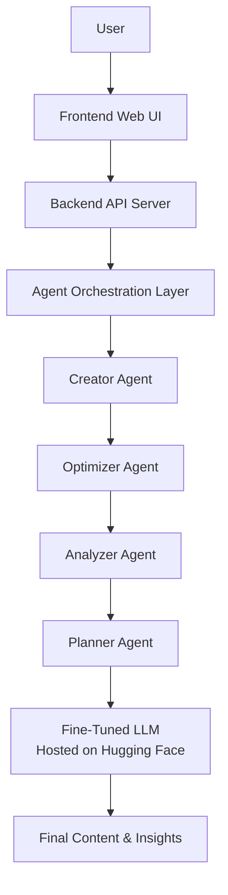

# UNISON.ai  
### An Agentic Content Management System

UNISON.ai is an AI-driven content intelligence system that helps creators, marketers, and teams **create, optimize, personalize, and analyze digital content** using a **single fine-tuned Large Language Model (LLM)** orchestrated through an **agentic workflow**.

Instead of using multiple disconnected AI tools, UNISON.ai provides a **central AI brain** that coordinates the entire content lifecycle end-to-end.

---

## 🚀 Problem Statement

Digital content workflows today are fragmented:
- Separate tools for writing, optimization, planning, and analysis
- Generic AI tools that lack platform awareness and strategy
- Manual iteration slows down creativity and productivity

There is no unified AI system that understands **content, intent, platform, and engagement together**.

---

## 💡 Solution Overview

UNISON.ai solves this by:
- Fine-tuning **one instruction-tuned LLM**
- Hosting it on **Hugging Face**
- Orchestrating it as **multiple task-specific agents**

Each agent performs a specialized role, while all intelligence comes from the **same core model**.

> **One model. Multiple agents. End-to-end content intelligence.**

---

## 🧠 Core Architecture

- **Single Fine-Tuned LLM** (LLaMA-3.1 / Mistral-7B)
- **Agent Orchestration Layer** (role-based prompts)
- **Backend API** to control workflow
- **Frontend UI** for user interaction

### Agents

- Creator Agent
- Optimizer Agent
- Analyzer Agent
- Planner Agent
- Final Content & Insights


All agents call the **same Hugging Face–hosted model** with different instructions.

---

## 🤖 Agents in UNISON.ai

| Agent | Responsibility |
|-----|---------------|
| Creator Agent | Generates initial content |
| Optimizer Agent | Improves hooks, tone, CTAs |
| Analyzer Agent | Tags content & predicts engagement |
| Planner Agent | Selects best output & planning suggestions |

---

## ✨ Key Features

- AI-powered content creation & rewriting
- Platform-specific optimization (Instagram, LinkedIn, etc.)
- Creative assistance for writers, designers, and marketers
- Content tagging & discovery
- Engagement prediction (Low / Medium / High)
- Unified agentic workflow using a single model

---

## 🧩 What Makes UNISON.ai Unique

- **Single-model architecture** (not one model per task)
- **Agentic orchestration** instead of one-shot generation
- **Instruction-tuned intelligence**, not generic prompts
- Clear separation of roles with shared knowledge

---

## 🛠️ Tech Stack

### AI & ML
- LLaMA-3.1-8B-Instruct / Mistral-7B
- QLoRA for efficient fine-tuning
- Hugging Face Transformers & PEFT

### Backend
- Python
- FastAPI
- Agent orchestration logic

### Frontend
- Web-based UI (React / HTML)

### Deployment
- Hugging Face Model Hub / Inference Endpoint

---
```
📂 Project Structure (High-Level)

kojo-ai/
│── backend/
│ ├── orchestrator.py
│ ├── agents/
│ └── api.py
│── frontend/
│ └── ui/
│── model/
│ └── fine-tuning/
│── requirements.md
│── design.md
│── README.md

```
---

## 🧪 How It Works (Simple)

1. User submits a content idea
2. Backend sends it to the Agent Orchestrator
3. Agents execute sequentially using the same LLM
4. Final optimized content and insights are returned

---

## 📈 Impact & Scalability

- Reduces content creation time significantly
- Improves content quality and consistency
- Scalable to:
  - Regional languages
  - Image & video generation
  - Enterprise content workflows

---

## 🏆 Hackathon Context

This project is built for **AWS AI for Bharat Hackathon (Hack2Skill)** and aligns with:

- AI for Media, Content & Digital Experiences
- Creativity, usability, and workflow enhancement focus

---
## System Architecture



## 📌 Future Enhancements

- Scheduling and auto-publishing
- Real engagement feedback loop
- Brand memory across sessions
- Multi-modal content support

---

## 👥 Team

**Team Name:** Passione 
**Team Lead:** Abishek 

---

## 📜 License
Open-source (for hackathon and educational purposes)

